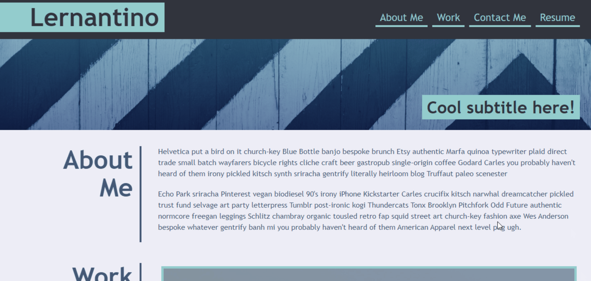

# Professional Portfolio :bust_in_silhouette:

A portfolio of work can showcase your skills and talents to employers looking to fill job position. An effective portfolio highlights your strongest work as well as the thought processes behind it. This is my web portfolio page created from scratch.

**Deployed Site: [Portfolio](https://armandosjunior.github.io/Professional-Portfolio/)**

---

### **Technical Criterias met:**
```
- Clickable image links

- Functional UI menu to corresponding sections

- Presentation of developer's name, a recent photo or avatar, and links to sections about them, their work, and how to contact them.
```


### **Steps for future development**
```
- Tidy up HTML!
- Present user with a more responsive layout that adapts to any size viewport.
```
